# Serverless DAM Bot on Azure

This document walks you through building a bot that allows you to find video and picture assets. Intelligent AI is used to extract metadata from image and video assets and these are indexed in Azure Search. The bot uses NLP to allow users to query and find the right assets.

## Pre-requirements

1. Azure Subscription
2. Azure Bot Emulator
3. Node JS (version)
4. [Optional] Visual Studio Code

**Before proceeding, clone this repo to your local machine**

## Setup
1. Create a Video Indexer Account at [https://video.ai](https://video.ai)
2. Sign up for the video indexer API at [https://api-portal.videoindexer.ai](https://api-portal.videoindexer.ai)
3. Grab the api key and the VI ID key for the next step.
4. Deploy the template by clicking the deploy button below

 <a href="https://ms.portal.azure.com/#create/Microsoft.Template/uri/https%3A%2F%2Fraw.githubusercontent.com%2Fjohndehavilland%2Fthatdambot%2Fmaster%2Fazure-deploy.json" target="_blank">
        
    </a>

## Deploy the Backend Processing
1. Locally, navigate to the Backend folder and for each function folder run npm install.
2. Right click and zip up the entire backend folder.
3. Navigate to the following url: `https://<yourfunctionname>.scm.azurewebsites.net/ZipDeploy`
4. Drag and drop the zip file into the folder and wait for it to be deployed.
5. When deployed, go to the storage account and create two containers (one called **videos** and one called **images**)
6. Now have to go back to the function app in the portal and update the following **two** application settings: 

*   `INDEXER_URL` whose value will be the URL of the index-document function. You can grab this by choosing the name of the function and clicking **Get Function URL**
*   `VIDEO_PROCESS_URL` whose value will be the url to video-process function.   

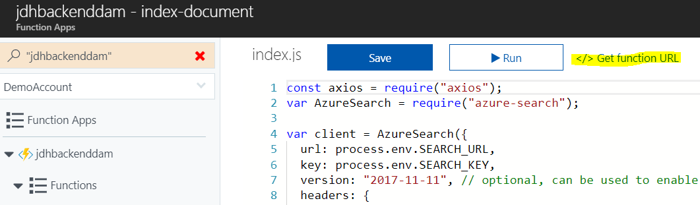

7. Make sure to save this after adding the app setting.
8. Now upload some sample images and videos to kick off the process of indexing.

## Create your basic NLP Model
1. Go to [https://www.luis.ai/home](https://www.luis.ai/home)
2. Create a new app

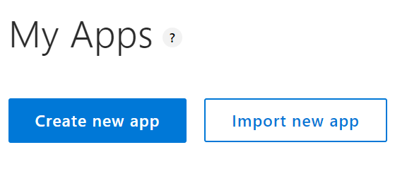

3. When the new app loads press Train

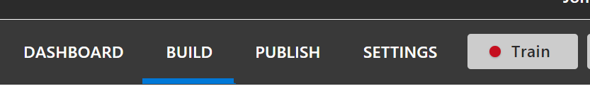

4. Go to publish and publish the app

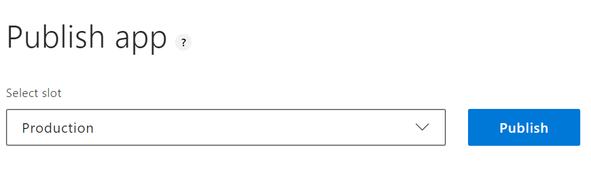

5. Grab the api key from the bottom of the publish page

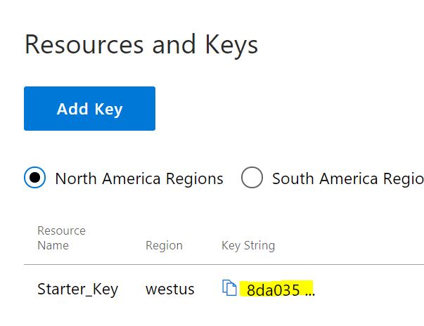

6. Grab the app id from the settings page

## Get the bot working

1. Locally, navigate to this repo you have cloned, navigate to the **Bot/messages** folder and run `npm install`
2. Create a .env file with the following values:
```
PORT=3978
MICROSOFT_APP_ID=
MICROSOFT_APP_PASSWORD=
KBID=
SUBSCRIPTION_KEY=<LUIS_KEY>
LuisAppId=<LUIS_ID>
LuisAPIKey=<LUIS_KEY>
LuisAPIHostName=westus.api.cognitive.microsoft.com
AzureWebJobsStorage=UseDevelopmentStorage=true
SEARCH_URL=https://<search_name>.search.windows.net
SEARCH_KEY=<azure_search_key>
NODE_ENV=development
ASSET_STORAGE=<path_to_images>
```
4. Run the app from messages folder with node index.js
3. Open the bot emulator and connect to the bot at "http://localhost:3978/api/messages"
4. Type Hi and ensure your output looks similar to below:

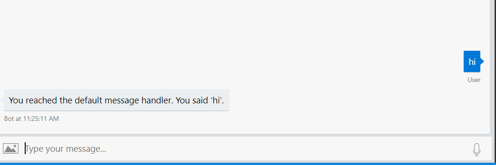

## Build out your LUIS Model
1. Go to build in the LUIS portal.
2. Select your app
3. Select **Build** and choose **Create New Intent** and call it **Greeting**

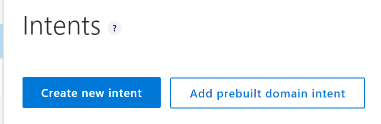

3. Add some utterances of how people may greet your bot (e.g. Hello, hi etc.)
4. Train
5. Publish
6. In the bot emulator - typing hi now should return a match to the greeting intent.

## Add a prebuilt domain
1. Go to build in the LUIS portal.
2. Select your app
3. Select **Build** and choose **Add pre-built domain**


4. Search for help and add Utilities.Help
5. Train
6. Publish
7. Update the bot code for the Help intent to match the right trigger name (Utilities.Help).
8. Rerun via `node index.js`
9. In the bot emulator - typing help now should return a match to the help intent.

## Build a search intent
1. Back in LUIS add in a new intent called **SearchAssets**.
2. Add some utterances such as *find pictures with people*.
3. For each utterance you will need to highlight two entities - searchType and searchTerm. To do this highlight the relevant sections of the phrase and either create the new entities or select if already created.

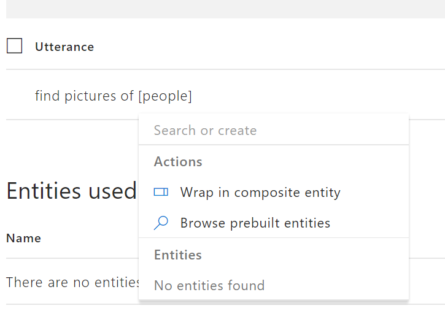

4. Train
5. Publish

## Update bot to handle search
1. In the code for the bot, add the following to the index.js, making sure the trigger matches the intent name you created in the step above:
```
bot.dialog('SearchAssets', [
    (session, args, next) => {
        session.send('We are searching for ' + session.message.text);
        // try extracting entities
        const searchType = builder.EntityRecognizer.findEntity(args.intent.entities, 'searchType');
        const searchTerm = builder.EntityRecognizer.findEntity(args.intent.entities, 'searchTerm');
        console.log("searchTerm: " + JSON.stringify(searchTerm.entity));
        console.log("searchTerm: " + searchType.entity);
        if (searchType.entity) {
            // city entity detected, continue to next step
            session.dialogData.searchType = searchType.entity;
            next({ response: searchTerm.entity });
        } else {
            // no entities detected, ask user for a destination
            builder.Prompts.text(session, 'Please try again');
        }
    },
    (session, results) => {
        const searchTerm = results.response;
        let message = 'Looking for assets';
        
       session.send(message);
       var assetAsAttachment = imageAsAttachment;
            if(session.dialogData.searchType == "videos" || session.dialogData.searchType == "video"){
                assetAsAttachment = videoAsAttachment;
            }
        // Async search
        Store
            .searchAssets(searchTerm, session.dialogData.searchType)
            
            .then(assets => {
                // args
                session.send(`I found ${assets.length} assets:`);
                let message = new builder.Message()
                    .attachmentLayout(builder.AttachmentLayout.carousel)
                    .attachments(assets.map(assetAsAttachment));
                session.send(message);
                // End
                session.endDialog();
            });
    }
]).triggerAction({
    matches: 'SearchAssets',
    onInterrupted:  session => {
        session.send('Please provide a search term or type help for more guidance');
    }
});
```
2. Run the bot emulator
3. Run node index.js and test out the bot for searching for images - it should return assets.

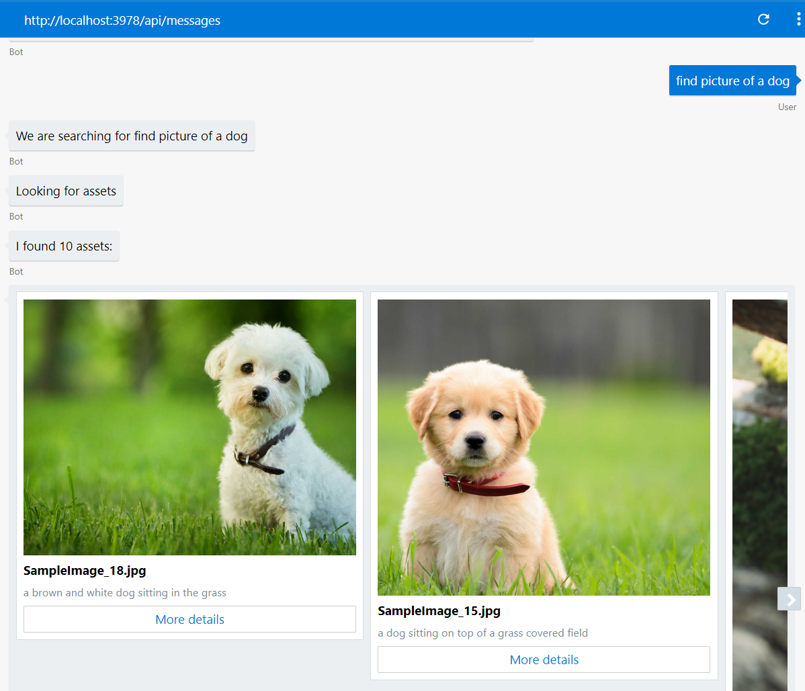

## [Optional] Add a Welcome Message
1. If you want the bot to proactively engage with your users and send the first message add the following code:

```
// Send welcome when conversation with bot is started, by initiating the root dialog
bot.on('conversationUpdate', function (message) {
    if (message.membersAdded) {
        message.membersAdded.forEach(function (identity) {
            if (identity.id === message.address.bot.id) {
                bot.beginDialog(message.address, "WelcomeDialog", '/');
            }
        });
    }
});

bot.dialog('WelcomeDialog',
    (session) => {
        session.send('Welcome to **thatDAMBot**. I am here to help you find your assets. What are you looking for?');
        session.endDialog();
    }
).triggerAction({
    matches: 'welcome'
})

```

## Deploy The Bot

1. To deploy the bot, first we create a bot app in Azure. For this we will use the Functions Bot.
2. In the Azure Portal, go to new and search for Functions Bot

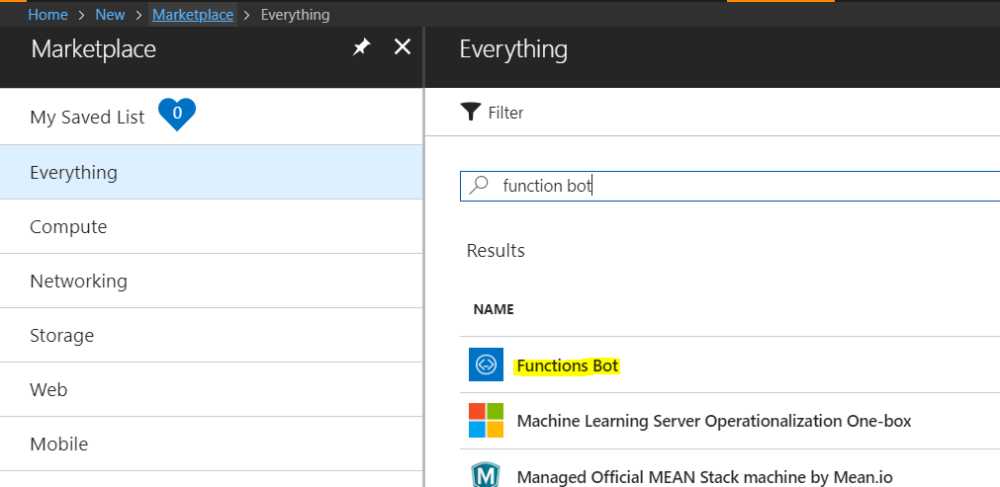

3. Set pricing to F0.
4. Select and fill out the details - for the bot template choose NodeJS and Basic Template.

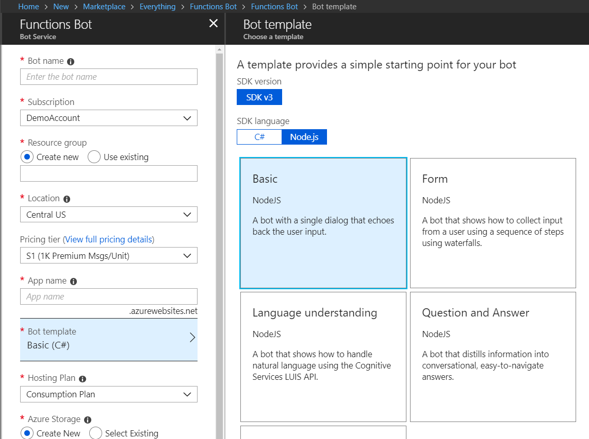

5. Select create and wait for the bot to create.
6. Locally, install *azure-functions-pack* using `npm install -g azure-functions-pack`
7. Navigate to the folder **Bot** and run `funcpack pack ./`
8. You now need to deploy the code to the bot you created. To do this, zip up the entire contents of the Bot folder (ensure to zip all the sub resources under the bot folder and not zip the bot folder).
9. Navigate to the bot website backend - https://<yourbotname>.scm.azurewebsites.net/ZipDeploy
10. Drag and drop you zip file into the folder space.
11. Go back to the portal and in the function app, select **Application Settings** and add the following settings and appropriate values.

```
LuisAPIHostName
LuisAPIKey
LuisAppId
SEARCH_KEY
SEARCH_URL
ASSET_STORAGE
```

12. Navigate to the bot resource and try out your bot by switching to the *Test in Web Chat* option.

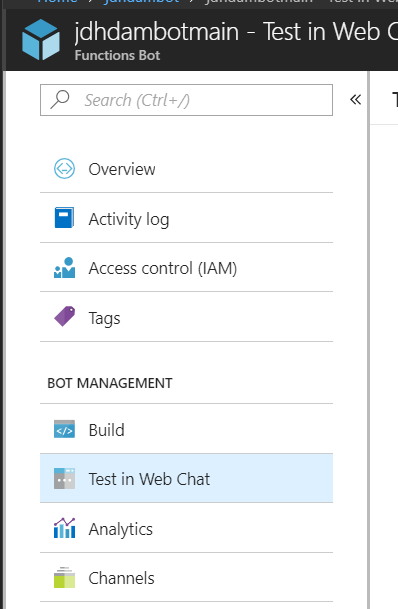

13. If all is wired up correctly, you should see an initial greeting

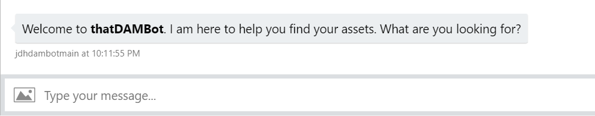

## Deploy to Channel
1. Under the bot resource choose channels

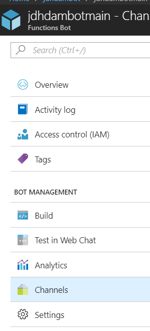

2. Choose the channel of your choice and configure the setup as per the guidance for the channel.